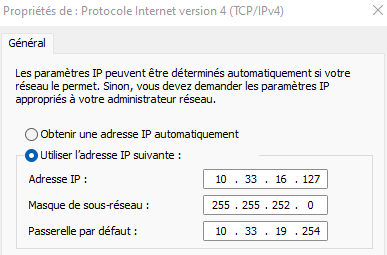
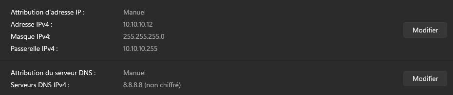
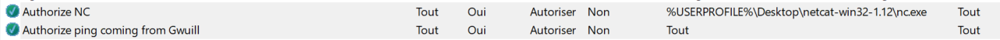
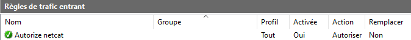
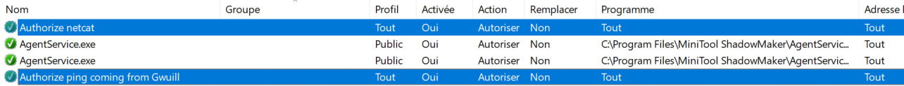
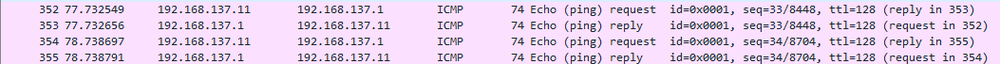
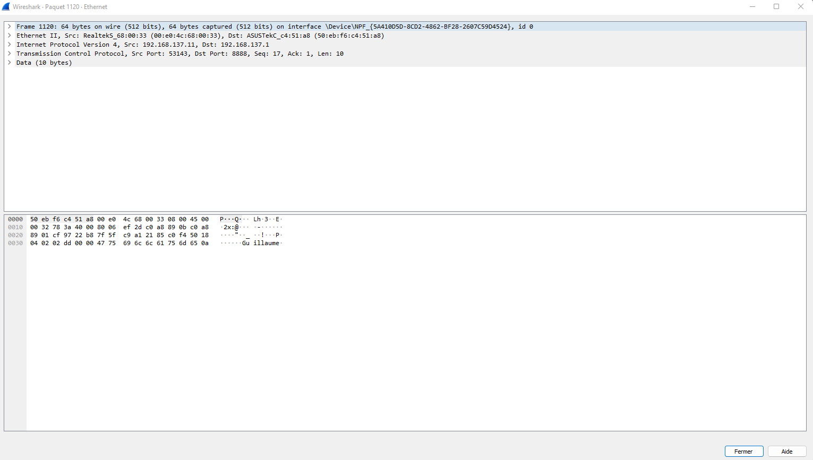

**🌞 Affichez les infos des cartes réseau de votre PC**

```
PS C:\Users\guill> ipconfig /all

Carte réseau sans fil Wi-Fi :

   Adresse physique . . . . . . . . . . . : 14-13-33-86-6A-1B
   Adresse IPv4. . . . . . . . . . . . . .: 10.33.16.127(préféré)
```

```
Carte Ethernet Ethernet :

   Adresse physique . . . . . . . . . . . : 50-EB-F6-C4-51-A8
```

**🌞 Affichez votre gateway**
```
  PS C:\Users\guill> ipconfig /all  
   Passerelle par défaut. . . . . . . . . : 10.33.19.254

```
**🌞 Déterminer la MAC de la passerelle**
```
PS C:\Users\guill> arp /a
Interface : 10.33.16.127 --- 0x4
  Adresse Internet      Adresse physique      Type
  10.33.19.254          00-c0-e7-e0-04-4e     dynamique
```

**🌞 Trouvez comment afficher les informations sur une carte IP (change selon l'OS)**


### A. Modification d'adresse IP (part 1)  

🌞 Utilisez l'interface graphique de votre OS pour **changer d'adresse IP** :
J'ai changé mon adresse ip par le panneau de configuration



```
PS C:\Users\guill> ipconfig /all
Carte réseau sans fil Wi-Fi :
   Adresse IPv4. . . . . . . . . . . . . .: 10.33.16.128(préféré)
   Passerelle par défaut. . . . . . . . . : 10.33.19.254
   ```


🌞 **Il est possible que vous perdiez l'accès internet.** .

En changeant d'ip on peut tomber sur une ip déjà utilisé et par conséquent le routeur va envoyer le paquet vers la première IP.
# II. Exploration locale en duo

## 3. Modification d'adresse IP

🌞 **Modifiez l'IP des deux machines pour qu'elles soient dans le même réseau**



🌞 **Vérifier à l'aide d'une commande que votre IP a bien été changée**
```
PS C:\Users\guill> ipconfig /all

Carte Ethernet Ethernet :

   Adresse IPv4. . . . . . . . . . . . . .: 10.10.10.12(préféré)
   Masque de sous-réseau. . . . . . . . . : 255.255.255.0
   Passerelle par défaut. . . . . . . . . : 10.10.10.255
```

🌞 **Vérifier que les deux machines se joignent**

```
PS C:\Users\guill> ping 10.10.10.11

Envoi d’une requête 'Ping'  10.10.10.11 avec 32 octets de données :
Réponse de 10.10.10.11 : octets=32 temps<1ms TTL=128
Réponse de 10.10.10.11 : octets=32 temps=1 ms TTL=128
Réponse de 10.10.10.11 : octets=32 temps=1 ms TTL=128
Réponse de 10.10.10.11 : octets=32 temps=1 ms TTL=128

Statistiques Ping pour 10.10.10.11:
    Paquets : envoyés = 4, reçus = 4, perdus = 0 (perte 0%),
Durée approximative des boucles en millisecondes :
    Minimum = 0ms, Maximum = 1ms, Moyenne = 0ms
```


🌞 **Déterminer l'adresse MAC de votre correspondant**

```
PS C:\Users\guill> arp -a
Interface : 10.10.10.12 --- 0xa
  Adresse Internet      Adresse physique      Type
  10.10.10.11           00-e0-4c-68-00-33     dynamique
```

## 4. Utilisation d'un des deux comme gateway

🌞**Tester l'accès internet**

```
PS C:\Users\guill> ping 1.1.1.1

Envoi d’une requête 'Ping'  1.1.1.1 avec 32 octets de données :
Réponse de 1.1.1.1 : octets=32 temps=21 ms TTL=55
Réponse de 1.1.1.1 : octets=32 temps=21 ms TTL=55
Réponse de 1.1.1.1 : octets=32 temps=54 ms TTL=55
Réponse de 1.1.1.1 : octets=32 temps=24 ms TTL=55

Statistiques Ping pour 1.1.1.1:
    Paquets : envoyés = 4, reçus = 4, perdus = 0 (perte 0%),
Durée approximative des boucles en millisecondes :
    Minimum = 21ms, Maximum = 54ms, Moyenne = 30ms
```
🌞 **Prouver que la connexion Internet passe bien par l'autre PC**

```
Command : tracert -4 1.1.1.1
```

```
Détermination de l’itinéraire vers one.one.one.one [1.1.1.1]
avec un maximum de 30 sauts :

  1     1 ms    <1 ms    <1 ms  Gwuill [192.168.137.1] 
  2     *        *        *     Délai d’attente de la demande dépassé.
  3     4 ms    43 ms     3 ms  10.33.19.254 
  4     9 ms     6 ms     5 ms  137.149.196.77.rev.sfr.net [77.196.149.137] 
  5    20 ms    15 ms    15 ms  108.97.30.212.rev.sfr.net [212.30.97.108] 
  6    46 ms    32 ms    34 ms  222.172.136.77.rev.sfr.net [77.136.172.222] 
  7    32 ms    41 ms    34 ms  221.172.136.77.rev.sfr.net [77.136.172.221] 
  8    28 ms    30 ms    32 ms  221.10.136.77.rev.sfr.net [77.136.10.221] 
  9    21 ms    21 ms    22 ms  221.10.136.77.rev.sfr.net [77.136.10.221] 
 10    30 ms    44 ms    25 ms  141.101.67.254 
 11    36 ms    31 ms    31 ms  172.71.128.2 
 12    22 ms    21 ms    21 ms  one.one.one.one [1.1.1.1] 

Itinéraire déterminé.
```

## 5. Petit chat privé

🌞 **sur le PC *serveur*** 
```
C:\Users\guill\Desktop\netcat-1.11>nc.exe -l -p 8888
ça marche
oui
Yes !

```
🌞 **sur le PC *client*** 

```
C:\Users\natha\Desktop\netcat-win32-1.12>nc.exe 192.168.137.1 8888
ça marche
Yes !
oui
```
🌞 **Visualiser la connexion en cours**

Server : 
```
 [nc.exe]
  TCP    192.168.137.1:51396    0.0.0.0:0              LISTENING
```

Client : 
```
[nc.exe]
  TCP    192.168.137.11:63663   13.69.68.64:443        ESTABLISHED
```

## 6. Firewall

Toujours par 2.

Le but est de configurer votre firewall plutôt que de le désactiver

🌞 **Activez et configurez votre firewall**
Côté server : 


```
Gwuill — Aujourd’hui à 14:21
PS C:\Users\guill> ping 192.168.137.11

Envoi d’une requête 'Ping'  192.168.137.11 avec 32 octets de données :
Réponse de 192.168.137.11 : octets=32 temps=1 ms TTL=128
Réponse de 192.168.137.11 : octets=32 temps=2 ms TTL=128
Réponse de 192.168.137.11 : octets=32 temps=1 ms TTL=128
Réponse de 192.168.137.11 : octets=32 temps=2 ms TTL=128

Statistiques Ping pour 192.168.137.11:
    Paquets : envoyés = 4, reçus = 4, perdus = 0 (perte 0%),
Durée approximative des boucles en millisecondes :
    Minimum = 1ms, Maximum = 2ms, Moyenne = 1ms
```

Côté client : 


```
C:\Users\natha>ping 192.168.137.1

Envoi d’une requête 'Ping'  192.168.137.1 avec 32 octets de données :
Réponse de 192.168.137.1 : octets=32 temps=1 ms TTL=128
Réponse de 192.168.137.1 : octets=32 temps=1 ms TTL=128
Réponse de 192.168.137.1 : octets=32 temps=2 ms TTL=128
Réponse de 192.168.137.1 : octets=32 temps=1 ms TTL=128

Statistiques Ping pour 192.168.137.1:
    Paquets : envoyés = 4, reçus = 4, perdus = 0 (perte 0%),
Durée approximative des boucles en millisecondes :
    Minimum = 1ms, Maximum = 2ms, Moyenne = 1ms
```
Côté server : 


Côté client : 

# III. Manipulations d'autres outils/protocoles côté client

## 1. DHCP

Bon ok vous savez définir des IPs à la main. Mais pour être dans le réseau YNOV, vous l'avez jamais fait.  

C'est le **serveur DHCP** d'YNOV qui vous a donné une IP.

Une fois que le serveur DHCP vous a donné une IP, vous enregistrer un fichier appelé *bail DHCP* qui contient, entre autres :

- l'IP qu'on vous a donné
- le réseau dans lequel cette IP est valable

🌞**Exploration du DHCP, depuis votre PC**

```
PS C:\Users\guill> ipconfig /all
  Bail obtenu. . . . . . . . . . . . . . : mardi 4 octobre 2022 14:08:20
  Bail expirant. . . . . . . . . . . . . : mercredi 5 octobre 2022 13:58:32
  Passerelle par défaut. . . . . . . . . : 10.33.19.254
  Serveur DHCP . . . . . . . . . . . . . : 10.33.19.254
```
## 2. DNS

Le protocole DNS permet la résolution de noms de domaine vers des adresses IP. Ce protocole permet d'aller sur `google.com` plutôt que de devoir connaître et utiliser l'adresse IP du serveur de Google.  

Un **serveur DNS** est un serveur à qui l'on peut poser des questions (= effectuer des requêtes) sur un nom de domaine comme `google.com`, afin d'obtenir les adresses IP liées au nom de domaine.  

Si votre navigateur fonctionne "normalement" (il vous permet d'aller sur `google.com` par exemple) alors votre ordinateur connaît forcément l'adresse d'un serveur DNS. Et quand vous naviguez sur internet, il effectue toutes les requêtes DNS à votre place, de façon automatique.

🌞** Trouver l'adresse IP du serveur DNS que connaît votre ordinateur**
```
PS C:\Users\guill> ipconfig /all
   Serveurs DNS. . .  . . . . . . . . . . : 8.8.8.8
```

🌞 Utiliser, en ligne de commande l'outil `nslookup` (Windows, MacOS) ou `dig` (GNU/Linux, MacOS) pour faire des requêtes DNS à la main
```
PS C:\Users\guill> nslookup google.com
Serveur :   dns.google
Address:  8.8.8.8

Réponse ne faisant pas autorité :
Nom :    google.com
Addresses:  2a00:1450:4007:813::200e
          142.250.179.78
```
```
 PS C:\Users\guill> nslookup ynov.com
Serveur :   dns.google
Address:  8.8.8.8

Réponse ne faisant pas autorité :
Nom :    ynov.com
Addresses:  2606:4700:20::ac43:4ae2
          2606:4700:20::681a:ae9
          2606:4700:20::681a:be9
          104.26.10.233
          104.26.11.233
          172.67.74.226

 ```
```
PS C:\Users\guill> nslookup 78.73.21.21
Serveur :   dns.google
Address:  8.8.8.8

Nom :    78-73-21-21-no168.tbcn.telia.com
Address:  78.73.21.21

```
```
PS C:\Users\guill> nslookup 22.146.54.58
Serveur :   dns.google
Address:  8.8.8.8

*** dns.google ne parvient pas à trouver 22.146.54.58 : Non-existent domain
```
# IV. Wireshark

🌞 Utilisez le pour observer les trames qui circulent entre vos deux carte Ethernet. Mettez en évidence :







